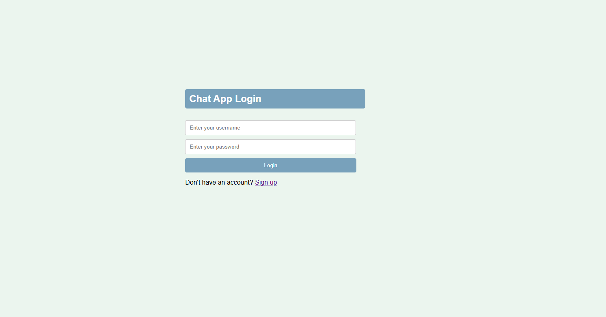
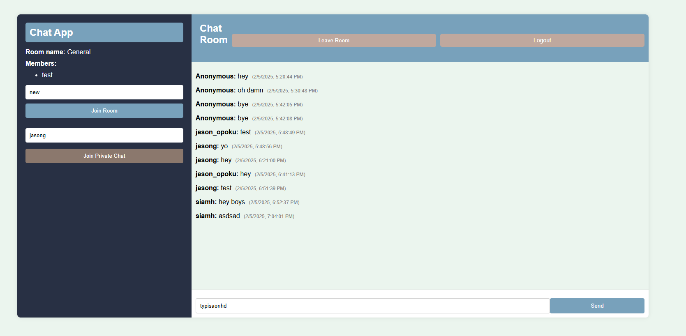

# COMP3133Labtest




# 📢 Real-Time Chat Application

## 📖 Overview
This is a **real-time chat application** that allows users to join public chat rooms, send private messages, and see who is online. The application is built using **Node.js, Express, Socket.io, and MongoDB** for message storage.

It includes features such as:
- 🏠 **Public chat rooms**
- 🔒 **Private messaging between users**
- 👥 **Real-time user list updates**
- ✍️ **Typing indicators**
- 📜 **Message history retrieval**
- 🔐 **User authentication with session storage**
- 🚪 **Join/leave rooms dynamically**

---

## 🛠️ **Tech Stack**
- **Frontend**: HTML, CSS, JavaScript
- **Backend**: Node.js, Express.js
- **Database**: MongoDB (Mongoose ODM)
- **Real-Time Communication**: Socket.io

---

## 🚀 **Features**

### ✅ **1. Public Chat Rooms**
- Users can **join and leave** chat rooms.
- Messages sent in a room are **broadcasted to all users**.
- Each room maintains its **own chat history**.

### ✅ **2. Private Chat Messaging**
- Users can **start private chats** by selecting a username.
- Private chats function **like individual chat rooms**.
- Messages are **only visible to the sender and receiver**.

### ✅ **3. Real-Time User Updates**
- When users **join or leave** a room, the member list updates.
- The sidebar displays the **current active users**.

### ✅ **4. Typing Indicator**
- Displays **"User is typing..."** when someone is typing.
- Disappears after **3 seconds of inactivity**.

### ✅ **5. Message Storage**
- Messages are stored in **MongoDB**.
- Users can see **previous messages** when they rejoin a room.

### ✅ **6. User Authentication**
- Users must enter a **username to access** the chat.
- Username is stored in **sessionStorage**.
- If a user logs out, they are redirected to the **login page**.

---

## 🏗️ **Setup Instructions**
### 📌 **1. Clone the Repository**
```sh
git clone https://github.com/AureliusJ/COMP3133Labtest
cd studentID_lab_test1_chat_app
localhost will be at 5000